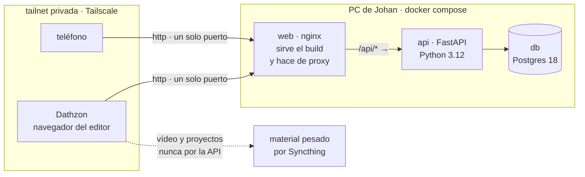

# Astrolabio

Taller de producción de contenido para **Voz del Cosmos**, un proyecto de
divulgación astronómica de dos personas.

El problema que resuelve no es «gestionar contenido»: es **el traspaso**. Cómo
pasa una pieza de las manos del investigador a las del editor y vuelve, sin que
ninguno tenga que preguntarle al otro en qué estado va.

La prueba de que funciona es que **dejen de mandarse mensajes** sobre el estado
de las piezas. Todo lo demás es infraestructura alrededor de eso.

| Rol | Quién | Qué hace |
|---|---|---|
| `investigador` | Johan | Investigación, guion, grabación. Responsable de la exactitud científica |
| `editor` | Su hermano | Edición y piezas gráficas |

---

## Estado

**Fase 0 — el esqueleto que camina.** Atraviesa el sistema entero de punta a
punta con la funcionalidad más delgada posible: navegador → Tailscale → React →
FastAPI → Postgres → una fila → y de vuelta.

Todo el riesgo real de este proyecto está en la **integración**, no en las
funciones. Por eso el esqueleto **no tiene dominio**: no hay estados de flujo,
ni guion, ni versiones de pieza. La entidad `pieza` tiene cuatro campos y
ninguno se llama `estado`.

No es un descuido. Los estados salen de una conversación con el editor, usando
sus palabras para su propio trabajo, y esa conversación todavía no ha ocurrido.
Modelarlos antes sería inventarlos — y es la parte divertida, que por eso es la
que se hace demasiado pronto.

Lo que ya funciona: sesión con cookie sobre la red privada, dos roles sembrados
desde el entorno, y autorización verificada en el servidor.

---

## Despliegue



Tres decisiones que explican ese dibujo:

- **Un solo origen.** El navegador conoce una dirección y un puerto; `web`
  sirve el frontend y hace de proxy de `/api`. Con orígenes separados la cookie
  de sesión sería *cross-site*, exigiría `SameSite=None` + `Secure`, y por
  Tailscale en HTTP plano sencillamente no viajaría. → [ADR 0005](docs/adr/0005-mismo-origen-tras-proxy.md)
- **Autoalojado, sin nube y sin puertos abiertos.** El servidor corre en
  hardware propio; el editor entra por Tailscale. El coste aceptado es la
  disponibilidad: si el PC está apagado, no hay taller. → [ADR 0002](docs/adr/0002-autoalojado-con-tailscale.md)
- **Los binarios pesados no entran.** Vídeo y proyectos de edición se
  sincronizan por fuera y la aplicación guarda **la ruta**, no el archivo.
  → [ADR 0003](docs/adr/0003-binarios-fuera-de-la-app.md)

---

## Cómo levantarlo

Requiere Docker y Docker Compose. Desde un clon limpio:

```bash
cp .env.example .env
```

```bash
docker compose up --build
```

Los tres servicios quedan arriba sin ningún paso manual adicional, y la
aplicación queda en `http://localhost:8080`.

Los valores de `.env.example` son marcadores de desarrollo, no credenciales de
nada real. **En cualquier despliegue que no sea el portátil de quien programa,
cámbialos.**

Para crear los dos usuarios:

```bash
docker compose run --rm api python -m app.seed
```

Las contraseñas salen del entorno (`SEED_*`), nunca del código.

---

## Comandos

```bash
docker compose up --build
```

```bash
docker compose run --rm api pytest
```

```bash
npm --prefix web run check
```

`check` es `tsc` + `build`. Todavía no corre vitest: el alcance de la Fase 0
define la calidad del cliente como «tsc + build», y no hay una sola prueba de
frontend que justifique la dependencia. Se añade cuando haya algo que probar en
el cliente, no antes.

---

## Stack

| Capa | Elección | Por qué |
|---|---|---|
| Frontend | React 18 + TypeScript + Vite + Tailwind 4 | Mismo que Grimoire, el otro proyecto del autor: no se vuelve a pagar la curva |
| Backend | Python 3.12 + FastAPI + SQLAlchemy 2.0 | Mismo que Grimoire; la ingesta de APIs de plataforma es Python natural |
| Base de datos | Postgres 18 | Dos usuarios escribiendo a la vez. SQLite serializa escrituras |
| Sesión | Cookie `HttpOnly` + Argon2id, estado en Postgres | Una cookie firmada no se puede invalidar → [ADR 0006](docs/adr/0006-sesiones-con-estado-en-postgres.md) |
| Empaquetado | Docker Compose | Hace reproducible el «todo local» y permite mudar el despliegue sin tocar código |
| Red | Tailscale | El editor entra por red privada cifrada, sin nube y sin abrir puertos |

**Tauri no se usa**, a diferencia de Grimoire, y es deliberado: el cliente del
editor tiene que ser un navegador.

---

## Seguridad

- La autorización se comprueba **en el servidor, en cada endpoint**. Ocultar un
  botón en el frontend no es autorización, es decoración: el editor no ve el
  botón de crear **y además** recibe 403 si se salta la interfaz.
- Contraseñas con **Argon2id**. Ningún hash sale por la API, nunca.
- Un login fallido responde lo mismo, y tarda lo mismo, exista la cuenta o no.
  La API no es un oráculo de qué usuarios hay.
- Ninguna credencial en el repositorio: todo por variables de entorno, con
  `.env.example` documentando las claves.

---

## Decisiones

Los registros de decisión están en [`docs/adr/`](docs/adr/). Son parte del
producto, no documentación de relleno: explican por qué el sistema es como es y
qué alternativas se descartaron.

| | |
|---|---|
| [0001](docs/adr/0001-fuente-de-verdad-por-type.md) | Fuente de verdad dividida por `type`, sin sincronización bidireccional |
| [0002](docs/adr/0002-autoalojado-con-tailscale.md) | Autoalojado, con acceso por Tailscale |
| [0003](docs/adr/0003-binarios-fuera-de-la-app.md) | Los binarios pesados viven fuera de la aplicación |
| [0004](docs/adr/0004-sin-rankings-bajo-umbral.md) | Sin rankings de tema bajo el umbral estadístico |
| [0005](docs/adr/0005-mismo-origen-tras-proxy.md) | Un solo origen: la web sirve el frontend y hace de proxy |
| [0006](docs/adr/0006-sesiones-con-estado-en-postgres.md) | La sesión vive en Postgres, no en una cookie firmada |

El alcance vigente está en [`docs/fase-0-esqueleto.md`](docs/fase-0-esqueleto.md).
