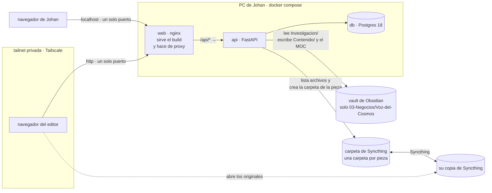

# Arquitectura — Astrolabio

Cómo se conecta el sistema: qué corre dónde, qué hace cada carpeta, cómo viaja
una petición y dónde vive cada dato. El porqué de cada elección está en
[`AGENTS.md`](../AGENTS.md) §3 y en los [ADR](adr/); este documento no lo
repite.

## 1. Visión general



- **Un solo origen.** El navegador conoce una dirección y un puerto: `web`
  sirve el frontend y reenvía `/api/*` a la API. La cookie de sesión viaja sin
  CORS ni `SameSite=None` ([ADR 0005](adr/0005-mismo-origen-tras-proxy.md)).
- **Autoalojado.** Todo corre en el PC de Johan; el editor entra por
  Tailscale, sin nube y sin puertos abiertos
  ([ADR 0002](adr/0002-autoalojado-con-tailscale.md)).
- **Los archivos pesados no pasan por la API.** Viajan entre las dos máquinas
  por Syncthing, y la app solo ve la copia de la máquina donde corre
  ([ADR 0003](adr/0003-binarios-fuera-de-la-app.md),
  [ADR 0010](adr/0010-la-carpeta-de-cada-pieza.md)).

## 2. Tecnologías

Las versiones exactas se fijan en `web/package.json`, `api/requirements.txt` y
las imágenes de `compose.yaml` y los `Dockerfile`; aquí solo qué es cada cosa.

| Parte | Tecnología |
|---|---|
| Cliente | React 18, TypeScript, Vite y Tailwind 4. El guion se pinta con `react-markdown`, `remark-gfm`, `remark-math` y `rehype-katex` |
| Proxy | nginx: sirve el build y reenvía `/api` |
| API | Python 3.12, FastAPI y uvicorn. SQLAlchemy 2.0 con psycopg 3, Alembic, pydantic-settings, argon2-cffi, PyYAML y Pillow |
| Base de datos | Postgres 18 |
| Pruebas | pytest y el `TestClient` de FastAPI, contra Postgres real; vitest para las funciones del cliente |
| Verificación | GitHub Actions, en cada push |
| Fuera de la app | Tailscale (red), Syncthing (archivos entre las dos máquinas), Obsidian con obsidian-git (el vault) |

No hay servicios de terceros: ni autenticación externa, ni correo, ni
analítica, ni almacenamiento en la nube.

## 3. Estructura del proyecto

```text
.
├── AGENTS.md                 instrucciones para agentes (CLAUDE.md lo importa)
├── compose.yaml              los tres servicios y sus montajes
├── .env.example              todas las variables, sin valores reales
├── api/
│   ├── app/
│   │   ├── main.py           monta los routers y /api/health
│   │   ├── config.py         la configuración, leída del entorno
│   │   ├── db.py             el motor y la sesión de SQLAlchemy
│   │   ├── models.py         las tablas
│   │   ├── security.py       hash y verificación de contraseñas
│   │   ├── auth.py           login, logout, /me y usuario_actual
│   │   ├── seed.py           crea los dos usuarios desde el entorno
│   │   ├── piezas.py         crear, listar, ver y editar piezas
│   │   ├── traspasos.py      la máquina de estados y su historia
│   │   ├── material.py       enlaces y la carpeta de la pieza en Syncthing
│   │   ├── tareas.py         la checklist de cada pieza y las tareas sueltas
│   │   ├── respaldo.py       lee las notas literature del vault
│   │   └── exportador.py     escribe la pieza en el vault
│   ├── migrations/           Alembic, una migración por cambio de esquema
│   └── tests/                pytest, una base `_test` aparte
├── web/
│   ├── src/
│   │   ├── main.tsx          punto de entrada
│   │   ├── App.tsx           sesión, tablero de piezas y pieza nueva
│   │   ├── Pieza.tsx         la vista de una pieza y sus paneles
│   │   ├── Guion.tsx         el guion: barra, campo y vista previa
│   │   ├── Temas.tsx         el tema y las etiquetas de la pieza
│   │   ├── Tareas.tsx        la lista de tareas: la checklist y las sueltas
│   │   ├── api.ts            pedir(), ErrorDeApi y los tipos de la API
│   │   ├── barra.ts          las acciones de la barra del guion, puras
│   │   ├── catalogo.ts       el catálogo de etiquetas, puro
│   │   ├── fechas.ts         las fechas de calendario, sin pasar por UTC
│   │   ├── flujo.ts          las palabras de estados y transiciones
│   │   ├── tablero.ts        las piezas repartidas por estado, puro
│   │   └── index.css         Tailwind y el estilo del guion renderizado
│   ├── nginx.conf.template   el proxy de /api y la caché de los assets
│   └── Dockerfile            compila con Node y sirve con nginx
├── docs/                     producto, arquitectura, diseño, fases y ADR
└── .github/workflows/        la verificación de cada push
```

Cada módulo de `api/app/` es un router con su prefijo bajo `/api`, y
`main.py` los monta todos. El cliente no tiene enrutador: o se está entrando,
o se está dentro, y dentro se ve el tablero o una pieza.

## 4. El camino de una petición

1. **El navegador** llama con `pedir` (`web/src/api.ts`) a una ruta relativa,
   en el mismo origen. nginx reenvía `/api/*` a la API sin quitar el prefijo.
2. **La sesión.** `usuario_actual` lee la cookie `astrolabio_sesion` —`HttpOnly`,
   `SameSite=Lax`—, busca su fila en `sesion` y comprueba que no haya
   caducado; dura siete días. Sin sesión válida, 401. Todas las rutas lo
   exigen salvo `/api/health` y el login, y una prueba recorre el esquema
   OpenAPI para que siga así.
3. **El rol.** El propio endpoint comprueba si ese rol puede hacer eso, y si
   no, 403 ([`AGENTS.md`](../AGENTS.md) §2.3). En una transición el orden es:
   409 si la transición no sale de ese estado, 403 si no es de tu rol, 404 si
   la pieza no existe y 409 si la pieza cambió mientras la mirabas. Para lo
   último, la fila de la pieza se bloquea (`SELECT … FOR UPDATE`) antes de
   comparar.
4. **El trabajo.** SQLAlchemy contra Postgres, o el sistema de archivos del
   vault o de Syncthing. Cada petición abre su sesión de base con `get_db`.
5. **La respuesta** sale por un modelo de Pydantic (`PiezaPublica`,
   `EnlacePublico`…) que declara lo que puede salir y nada más: el hash de una
   contraseña no sale nunca.
6. **Los errores.** `pedir` convierte una respuesta de error en `ErrorDeApi`,
   con el `detail` de la API como mensaje, y el panel lo enseña.

## 5. Datos y archivos

### Base de datos

| Tabla | Qué guarda | Regla |
|---|---|---|
| `usuario` | Nombre, hash Argon2id y rol (`investigador` o `editor`) | Se siembran desde el entorno |
| `sesion` | El testigo de la cookie, su usuario y su caducidad | Cerrar sesión borra la fila ([ADR 0006](adr/0006-sesiones-con-estado-en-postgres.md)) |
| `pieza` | Título, guion, formato, tema, plataforma, respaldo, etiquetas, estado, y las fechas de entrega del diseño y de publicación prevista | Un `CHECK` admite solo los seis estados. La API admite solo los cuatro temas y guarda las etiquetas normalizadas ([ADR 0011](adr/0011-las-etiquetas-viajan-al-vault.md)). Las fechas son `DATE`: días, sin hora ni zona |
| `traspaso` | Transición, estado de origen y de destino, quién, cuándo y una nota | Solo inserción: un trigger rechaza `UPDATE`, `DELETE` y `TRUNCATE` ([ADR 0008](adr/0008-traspaso-append-only-en-la-base.md)) |
| `enlace` | URL, nota, quién y cuándo | Solo `http` y `https`, validado en el servidor |
| `tarea` | Texto, la pieza si la tiene, quién la marcó y cuándo, quién la creó y cuándo | Sin pieza es suelta. Estar hecha es tener quién la marcó: desmarcarla lo borra. No es historia: se borra, como el material |

El esquema lo crean las migraciones de Alembic, que corren al arrancar el
contenedor de `api` (`alembic upgrade head` y después uvicorn). No hay
`create_all` en ninguna parte, y una prueba lo vigila. Las pruebas migran su
propia base, `<base>_test`, y cada una corre en una transacción que se
revierte.

### Carpetas montadas

Las dos son opcionales: sin ellas la app arranca, y su panel dice por qué no
hay nada.

| Variable (host) | En el contenedor | Qué hace la app |
|---|---|---|
| `VAULT_HOST_PATH` → `03-Negocios/Voz-del-Cosmos/` | `/vault` | Lee las notas de `Investigacion/Recursos`; `Investigacion/` se monta aparte, en solo lectura. Al exportar, escribe en `Contenido/` y en el MOC ([ADR 0007](adr/0007-como-escribe-astrolabio-en-el-vault.md)) |
| `SYNCTHING_HOST_PATH` → la carpeta compartida | `/material` | Busca la carpeta de cada pieza por su número, lista sus archivos y crea la que falta. De cada imagen hace al vuelo una miniatura WebP de menos de 200 kB, que no guarda. No escribe nada más ([ADR 0010](adr/0010-la-carpeta-de-cada-pieza.md)) |

La carpeta de Syncthing tiene que tener su `.stfolder`: si no lo tiene, la
ruta del `.env` no es la compartida y la app no crea nada en ella.

## 6. Seguridad

- **La autorización, en el servidor**, en cada endpoint, y cada regla con su
  prueba de 403. Ocultar un botón no es autorización.
- **Contraseñas** con Argon2id. Un login fallido responde lo mismo y tarda lo
  mismo, exista la cuenta o no: se verifica contra un hash señuelo.
- **Sesión con estado en Postgres**: un testigo robado deja de servir al
  cerrar sesión.
- **Credenciales, solo en el entorno.** `.env.example` documenta las claves,
  sin valores reales.
- **Lo que entra se valida en el servidor**: los enlaces con `HttpUrl`, las
  transiciones contra la tabla de `traspasos.py`.
- **Ninguna ruta sale de su carpeta.** `respaldo.dentro_de` resuelve los
  enlaces simbólicos antes de comparar. El vault se monta acotado a
  `03-Negocios/Voz-del-Cosmos/`, con `Investigacion/` en solo lectura; el
  diario de Johan no es alcanzable ni desde el código.
- **`/api/health` es público y no filtra nada**: de un fallo de la base da el
  nombre de la excepción, no su texto, que llevaría la cadena de conexión.

## 7. Despliegue

- **Dónde.** Docker Compose, en el PC de Johan: `db` con su volumen
  `db-data`, `api` expuesta solo dentro de la red de compose, y `web`, la
  única que publica un puerto (`WEB_PORT`).
- **Cómo entra el editor.** Por Tailscale, al mismo puerto, en HTTP dentro de
  la tailnet (`COOKIE_SECURE=false`). Si algún día se sirve por HTTPS, la
  cookie pasa a `Secure` cambiando esa variable
  ([ADR 0002](adr/0002-autoalojado-con-tailscale.md)).
- **Configuración.** Todo en `.env`, copiado de `.env.example`.
- **Caché.** Los assets llevan un hash en el nombre y se cachean para
  siempre; `index.html` no se cachea, para que un despliegue llegue al
  navegador.
- **Verificación.** En cada push, GitHub Actions levanta compose y corre las
  migraciones y pytest; en el cliente corre `tsc`, vitest y `vite build`.

## 8. Escala y operación

- **Dos usuarios.** No hay colas, ni trabajos en segundo plano, ni caché de
  aplicación, y no hacen falta.
- **Un solo contenedor de API.** Por eso las migraciones pueden correr al
  arrancar; con varios, pasarían a un paso de despliegue aparte.
- **Las miniaturas se generan al vuelo** (ADR 0010). Si algún día pesan, se
  guardan y el ADR se revisa.
- **Disponibilidad**: la del PC de Johan. `/api/health` comprueba la
  conexión real con Postgres y responde 503 si falla; compose espera a que la
  base esté sana antes de arrancar la API.
- **Copias de seguridad: el repositorio no programa ninguna.** Los datos
  viven en el volumen `db-data`. El ADR 0003 cuenta con que la base es
  pequeña y cabe en un `pg_dump`, pero nada aquí lo ejecuta: si se borra el
  volumen —por ejemplo, restaurando Docker Desktop a fábrica—, se pierden las
  piezas y su historia.
