# PRD — Astrolabio

Qué se construye, para quién y cómo se sabe si funciona. Los criterios
verificables de cada fase viven en su propio documento (`docs/fase-N-….md`);
este los enlaza en vez de copiarlos. Las reglas para trabajar en el código
están en [`AGENTS.md`](../AGENTS.md).

## 1. Resumen

- **Producto**: Astrolabio.
- **En una línea**: el taller donde se producen las piezas de Voz del Cosmos,
  un proyecto de divulgación astronómica de dos personas.
- **Visión**: que una pieza pase de las manos de uno a las del otro, y vuelva,
  sin que ninguno tenga que preguntarle al otro en qué estado va.

## 2. Problema

Voz del Cosmos lo hacen dos personas. Johan investiga y escribe el guion; su
hermano diseña y edita las piezas. Cada pieza cambia de manos varias veces, y
hoy cada cambio va por mensaje: si los cuadros de flujo y de materiales están
listos, si una pieza cumple los requisitos, si está aprobada
([estados §5](estados-del-flujo.md)). Las referencias —pines, vídeos,
imágenes— también llegan por chat.

El problema no es «gestionar contenido»: es **el traspaso**.

## 3. Objetivo

**Que dejen de mandarse mensajes sobre el estado de las piezas.** Una función
que no contribuya a eso es secundaria, por vistosa que sea.

## 4. Usuarios

| Rol | Quién | Qué hace | Desde dónde |
|---|---|---|---|
| `investigador` | Johan | Investigación, guion, grabación y material. Responde de la exactitud científica. Escribe con LaTeX y guarda su investigación en Obsidian | Su PC, donde corre la app |
| `editor` | Su hermano (`dathzon`) | Producción de diseño: hace y edita las piezas gráficas en sus programas de diseño, por bloques semanales, quincenales o mensuales | Su máquina, con el navegador, por Tailscale |

Él no se llama a sí mismo «editor»: se describe como «producción de diseño y
asesor de diseño, comunicación y manejo de redes sociales». Si esa palabra le
sirve en pantalla sigue abierto ([estados §6](estados-del-flujo.md)).

## 5. Lo que hace hoy

| Fase | Qué quedó | Criterios |
|---|---|---|
| 0 — Esqueleto | Sesión con cookie, dos roles sembrados desde el entorno, autorización comprobada en el servidor | A–E · [fase 0](fase-0-esqueleto.md) |
| 1 — Fuente de verdad dividida | Piezas con guion en markdown y LaTeX, con vista previa. El respaldo científico del vault, en solo lectura y solo para Johan. Exportar la pieza al vault | F–J · [fase 1](fase-1-vault.md) |
| 2 — El traspaso | Seis estados, transiciones con reglas por rol, historia de solo inserción, de quién es cada pieza, el estado en el vault | K–O · [fase 2](fase-2-traspaso.md) |
| 3 — El material | Enlaces de referencia en la pieza, y la carpeta de cada pieza en Syncthing con sus archivos, las miniaturas de las imágenes y la ruta de cada uno para copiarla. Falta la prueba con el editor desde su máquina | P–S · [fase 3](fase-3-material.md) |
| 4 — Escribir con herramientas | Una barra de diez botones y atajos para el guion, que Ctrl+Z deshace de un paso; `mk` y `dm` abren fórmula; tablas y notas al pie en la vista previa; la pieza a 1024 px. Falta su prueba en el uso | T–X · [fase 4](fase-4-escritura.md) |
| 5 — Temas y etiquetas | Cuatro temas fijos, etiquetas libres con un catálogo de qué se ha hablado que filtra la lista, y las etiquetas en el vault como tags anidados bajo `voz-del-cosmos`. Falta su prueba en el uso | Y–AA · [fase 5](fase-5-temas.md) |
| 6 — Tablero, tareas y fechas, **alcance vigente** | Un tablero por estado en lugar de la lista, tareas por pieza y sueltas, fechas de entrega y de publicación, y las semanas que vienen | AB–AF · [fase 6](fase-6-tablero.md) |

Quién puede qué, hoy:

- **Los dos**: ven todas las piezas, editan el guion y los datos de la pieza,
  mueven la pieza cuando la transición es suya y añaden o quitan material.
- **Solo Johan**: crea piezas, ve y enlaza el respaldo científico de su vault
  y exporta la pieza al vault.

## 6. Flujos

### 6.1 El traspaso

Los estados y los nombres de las transiciones son las palabras del editor
([estados-del-flujo.md](estados-del-flujo.md)).

```mermaid
stateDiagram-v2
    direction LR
    state "investigación" as investigacion
    state "solicitud entregada" as solicitud_entregada
    state "material aprobado" as material_aprobado
    state "finalizada" as finalizada
    state "diseño aprobado" as diseno_aprobado
    state "publicada" as publicada

    [*] --> investigacion
    investigacion --> solicitud_entregada: Entregar (Johan)
    solicitud_entregada --> material_aprobado: Aprobar el material (los dos)
    solicitud_entregada --> investigacion: Devolver (editor)
    material_aprobado --> finalizada: Finalizar (editor)
    finalizada --> material_aprobado: Devolver (Johan)
    finalizada --> diseno_aprobado: Aprobar el diseño (Johan)
    diseno_aprobado --> publicada: Publicar (Johan)
```

Falta en el dibujo, para no taparlo: **Reformular**, de cualquiera de los dos,
devuelve la pieza a `investigación` desde cualquier estado entre `solicitud
entregada` y `diseño aprobado`. **Devolver** es aplicar ajustes; **reformular**
es reconstruir la pieza con otro formato, idea o medio.

- **Cada pieza es de alguien.** A Johan le tocan `investigación`, `solicitud
  entregada`, `finalizada` y `diseño aprobado`; al editor, `material
  aprobado`; `publicada` no es de nadie. El tablero pone una columna por
  estado, y las piezas que te tocan van marcadas «Te toca».
- **Todo queda en la historia**: quién movió la pieza, cuándo, y una nota
  opcional. La historia no se edita ni se borra.
- **Lo irreversible se confirma.** Después de «Aprobar el diseño» la pieza ya
  no vuelve al editor, y después de «Publicar» ya no se mueve.
- **Si la pieza cambió mientras la mirabas**, la app lo dice y no la mueve.

### 6.2 Escribir el guion y llevarlo al vault

1. Johan crea la pieza con su título.
2. Cualquiera de los dos escribe el guion en markdown, con las fórmulas entre
   `$…$` o `$$…$$` y la vista previa al lado, y lo guarda.
3. Johan enlaza las notas de respaldo de su vault, que la app lee sin
   escribirlas.
4. Johan la exporta: la nota `type: contenido` se escribe en `Contenido/` del
   vault, marcada como generada, con el estado en `status`.

### 6.3 Pasar el material

1. En el panel «Material» de la pieza, cualquiera de los dos pega un enlace
   —un pin, un vídeo, un artículo— con una nota de para qué sirve.
2. Cualquiera de los dos crea con un botón la carpeta de la pieza en
   Syncthing, `<id> - <título>`. Lo que uno ponga en ella llega a la máquina
   del otro, y la app lo lista con su tamaño y su fecha.
3. Las imágenes se ven en miniatura. «Copiar ruta» da la ruta del archivo
   dentro de la carpeta compartida, para encontrar el original en la copia
   propia y arrastrarlo al programa de diseño.

## 7. Requisitos

### Funcionales

Los que no se negocian; cada uno tiene su invariante en
[`AGENTS.md`](../AGENTS.md) §2:

- La autorización se comprueba en el servidor, en cada endpoint, y cada regla
  de quién puede qué tiene su prueba de 403 (§2.3).
- La historia del traspaso es de solo inserción, y lo impone la base (§2.6).
- Las piezas se editan solo en Astrolabio: el vault recibe una copia marcada
  como generada, y el respaldo científico se lee del vault sin escribirlo
  (§2.1). El LaTeX del guion llega intacto.
- Los archivos pesados no pasan por la app: viajan por Syncthing, y la app
  guarda dónde están, con la excepción de una miniatura de menos de 200 KB
  (§2.2).
- La app no lee nada del vault fuera de `03-Negocios/Voz-del-Cosmos/` (§2.5).

### De experiencia

- Cada pieza dice de quién es: «Te toca», «Le toca a Johan», «Le toca al
  editor».
- Los errores dicen la causa, en español: «Solo se aceptan enlaces http o
  https.», «La pieza cambió de estado mientras la mirabas. Recarga para ver
  dónde está.».
- Lo que no está configurado —el vault, Syncthing— se dice en su panel. No es
  un error, y el resto de la app funciona igual.

### De rendimiento

No hay ninguno escrito: con dos usuarios no ha hecho falta. Lo decidido va en
el otro sentido, no complicar por rendimiento: las miniaturas se generan al
vuelo y no se guardan ([ADR 0010](adr/0010-la-carpeta-de-cada-pieza.md)).

### De plataforma

- **Cliente**: el navegador. El editor no instala nada.
- **Servidor**: el PC de Johan, con Docker Compose. Si el PC está apagado, no
  hay taller ([ADR 0002](adr/0002-autoalojado-con-tailscale.md)).
- **Red**: Tailscale, sin nube y sin puertos abiertos.
- **Concurrencia**: dos personas escribiendo a la vez; por eso Postgres y no
  SQLite.

## 8. Métricas de éxito

1. **Los mensajes.** Que dejen de preguntarse por mensaje en qué estado va una
   pieza, si está aprobada o si el material está listo. Se comprueba en el
   uso, no en la base.
2. **Dónde se atasca.** Cuánto tarda una pieza entre `solicitud entregada`
   —lo más parecido al «guion cerrado» del §2.6— y `publicada`, y en qué etapa
   se detiene. Sale de la tabla `traspaso`, que es de solo inserción justo
   para eso. Hoy se registra; ninguna pantalla lo muestra todavía.
3. **Cómo le va a lo publicado.** El panel de métricas de plataforma aún no
   existe. Cuando llegue, conteos y curvas individuales, sin rankings de tema
   con menos de ~5 piezas por combinación
   ([ADR 0004](adr/0004-sin-rankings-bajo-umbral.md)).

## 9. Fuera de alcance

- Sincronización bidireccional del texto con el vault (§2.1).
- Subir archivos desde el navegador, o vídeo y proyectos a través de la API
  (§2.2).
- Rankings de temas con `n` pequeño (§2.7).
- Un proveedor de identidad externo: son dos usuarios con sesión propia.
- Una aplicación nativa: el cliente del editor es el navegador.
- Vistas previas de enlaces traídas por el servidor, que abrirían la puerta a
  SSRF ([fase 3](fase-3-material.md)).

Lo que se descartó dentro de cada fase está en su documento.

## 10. Lo que viene

El tablero con tareas y fechas (fase 6) es la última fase de la
[hoja de ruta](hoja-de-ruta.md). Lo que venga después saldrá del uso; el
panel de métricas de §8 todavía no tiene fase.

## 11. Preguntas abiertas

De la conversación con el editor ([estados §6](estados-del-flujo.md)),
pendiente de hacerse en vivo:

- ¿Los «copys in graphic» son el guion o un texto aparte?
- ¿Voz del Cosmos hace impresos?
- Lo que él llama «tipo de pieza» es lo que el código llama `formato`, y lo
  que él llama «formato» no existe en el modelo. Hay que resolverlo antes de
  que las dos palabras convivan en pantalla.
